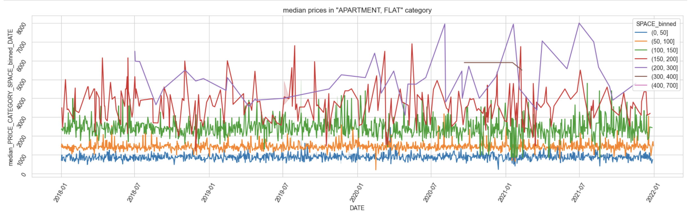
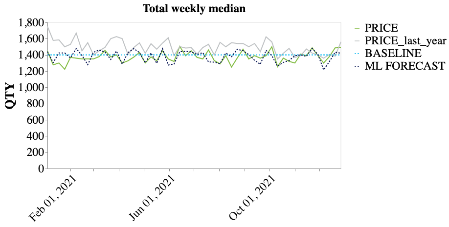
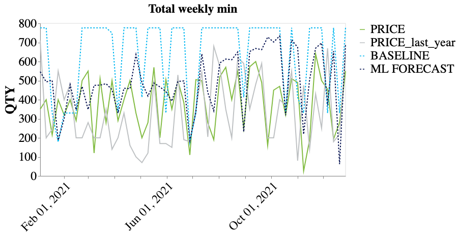
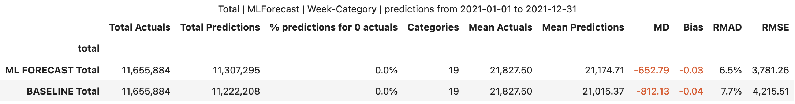
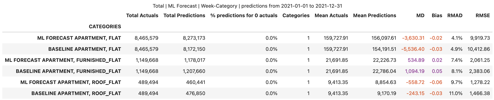

# Rental Price Development
The goal of this project is a rental price forecasting model based on the prices of rental properties published on the platform over the last few years for multiple subcategories exactly for one location.

# Highlights of Exploratory data analysis
- Data contains prices for rental properties of various sizes from 2018-01-01 up to 2021-12-31 recorded on day-category granularity
- Some categories have just few records 
- There seems to be change in categories naming in the end of 2019 (e.g "APARTMENT" was renamed into "APARTMENT, FLAT"). To improve data quality, such categroies are merged together.
- Prices and space size are highly correlated
- Median of prices in a category are quite stable in each of space bins and don't change much with time. Example for "APARTMENT, FLAT" category:
- 
  

# Scope definition
- Due to lack of time, all records with missing prices and/or space information are removed from the dataset
- Categories with just few records (less than 21) are removed from dataset
- After cleaning and merging, 20 categories are remaining in data
- Data constains outliers (very high or very low prices or/and spaces). The outliers are removed

# Modeling and evaluation
As a baseline I use median prices in category/space-sizes-bins. 

As a alternative to baseline, I created ML model with XGBoost regressor with GridSearchCV for hyperparameter optimisation. XGBoost is very robost and efficient algorithm, which will be easy to support in future use in production enviroment. However it does not work with time-series data and many time-related features were created instead.

To demonstrate performance of our ML model back-testing is used: data from 2018 till end of 2020 is used for training and data from 2021 is used for the model evalution on week-category level.
Here is median of prices forecast comparison with actual prices:

Both models give good estimation of median. However baseline model overforecast prices minimum:

To quantify the performance severl metrics used for the evaluation: 
$$bias  = { \sum forecast_{i} - \sum actuals_{i} \over \sum actuals_{i}}$$
$$RMAD = {{mean(|forecast_{i} - actuals_{i}|)} \over mean(actuals_{i})}$$
$$RMSE = mean(\sqrt{(forecast_{i} - actuals_{i})^2})$$

bias gives as direct over- or under- estimation of prices. RMAD gives us estimation of how good median of prices is predicted. RMSE tells us how close mean values of prices are predicted and also is sensitive to outliers

Overall KPIs:

KPIs per categories:

As one can see both models give quite good forecast. The ML based model catched the main property of data and gives as good forecast as a simple baseline. However ML model performs only slightly better compare to baseline and most probably has room for improvement, especially in categories, which does not have much data so far. Due to lack of time is was not investigated, but definetly should be adressed in a follow up study.

# Outlook
During one-day project it was not possible to cover many things. Below is list of open items, which could be covered next:
- Some data (e.g outliers and categories with just a few data points) requires attention and discussion with stakeholders.
- As objective function I used the absolute error (reg:absoluteerror), one can experiment with different build-in objective functions
- ML model performance is not satisfying in some categories, which should be adressed with deep dive analysis
